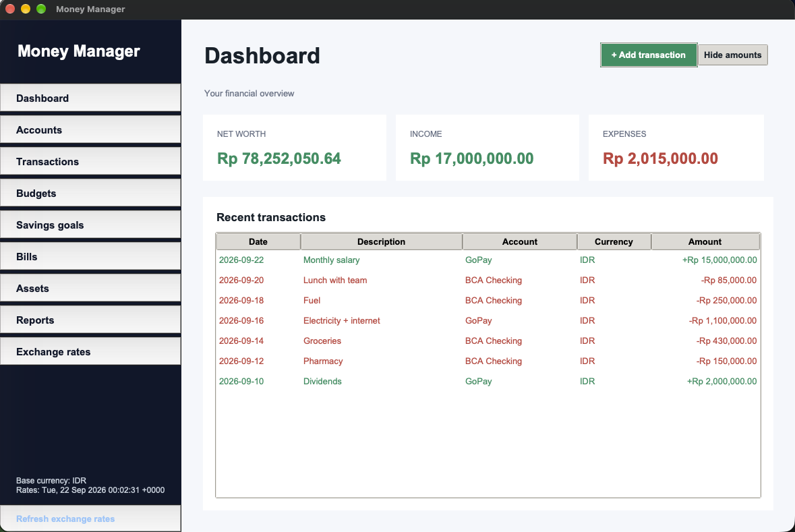

# Money Manager

A private, offline-first personal finance app for macOS. Track accounts, transactions, budgets, savings goals, bills and assets in multiple currencies — all stored locally on your Mac, protected by a PIN or Touch ID.



## Download

Grab the latest `MoneyManager-macOS-arm64.zip` from **[Releases](https://github.com/Mqdd27/money-manager/releases/latest)**, unzip it and drag **Money Manager.app** into `Applications`.

The app is not notarized, so macOS will block the first launch. Either right-click the app → **Open**, or run:

```sh
xattr -dr com.apple.quarantine "/Applications/Money Manager.app"
```

Requires an Apple Silicon Mac (M1 or later).

## Features

- **Dashboard** — net worth, income and expenses at a glance, with a one-click "hide amounts" privacy toggle
- **Accounts** — cash, bank, e-wallet and investment accounts, each in its own currency
- **Transactions** — income/expenses by category; balances update automatically, edit or delete any time
- **Budgets, savings goals, bills and assets** — monthly budgets per category, goal progress, upcoming bills, and what you own
- **Multi-currency** — 13 currencies (IDR base) with live exchange rates from [open.er-api.com](https://open.er-api.com)
- **Reports** — expense breakdown by category, export to Excel or PDF
- **Secure** — PIN (PBKDF2-hashed) or Touch ID unlock
- **Local only** — data lives in `~/Library/Application Support/MoneyManager/money_manager.db` (SQLite). No accounts, no cloud.

## Run from source

Requires Python 3 with Tkinter.

```sh
python3 -m venv .venv
.venv/bin/pip install -r requirements.txt
.venv/bin/python main.py          # run the app
.venv/bin/python main.py --check  # quick self-check
```

## Build the app

```sh
.venv/bin/pip install pyinstaller
.venv/bin/pyinstaller MoneyManager.spec
```

The bundle is written to `dist/`.

## Tech

Python · Tkinter · SQLite · `Decimal` for all money math · PyInstaller
